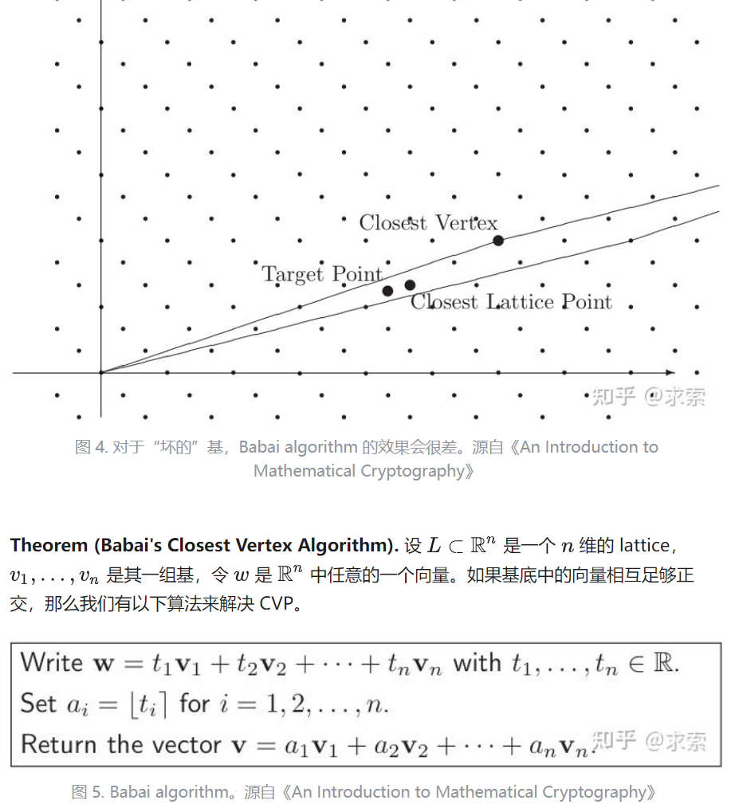

:::tip[前言]

很荣幸为本次TSCTF-J命制密码三字经系列，中途考虑上道简单的但犹豫很久决定放在AB里供大家娱乐

:::

## 野狐禅

:::note[题目描述]

你要算到第几步才能发现对手的陷阱？

:::


```python
import secrets
import random
from Crypto.Util.number import *
from secret import flag, a, b, m

class LCG:
    def __init__(self):
        self.m = m
        self.state = random.randrange(0, self.m)
        self.a = a
        self.b = b

    def next(self): 
        self.state = (self.a * self.state + self.b) % self.m
        return self.state

class SimplePaillier:
    def __init__(self, bits=1024):
        self.n = getPrime(bits // 2) * getPrime(bits // 2)
        self.n2 = self.n * self.n
        self.g = self.n + 1

    def encrypt(self, m_int, r_int):
        return (pow(self.g, m_int, self.n2) * pow(r_int, self.n, self.n2)) % self.n2

def genlist(b):
    n = bytes_to_long(b)
    digs = []
    while n > 0:
        digs.append(n % 3)
        n //= 3
    return list(digs)

def main():
    coeffs = genlist(flag)
    k = len(coeffs)
    eqs = k

    lcg = LCG()
    paillier = SimplePaillier()

    y = [secrets.randbelow(3) for _ in range(k)]

    for i in range(eqs):
        s = 0
        for j in range(k):
            s += coeffs[j] * y[i + k - 1 - j]
        y.append(s)

    ciphertexts = []
    lcg_raws = []

    for m_val in y:
        while True:
            raw = lcg.next()
            r = raw % paillier.n
            if r == 0:
                continue
            if GCD(r, paillier.n) != 1:
                continue
            break
        c = paillier.encrypt(m_val, r)
        ciphertexts.append(str(c))
        lcg_raws.append(str(raw))

    with open("challenge.txt", "w") as f:
        f.write(f"n: {paillier.n}\n")
        f.write(f"g: {paillier.g}\n")
        f.write(f"k: {k}\n")
        f.write(f"eqs: {eqs}\n")
        for c in ciphertexts:
            f.write(c + "\n")
        for raw in lcg_raws:
            f.write(raw + "\n")

if __name__ == "__main__":
    main()
```


本题考察LCG伪随机数、Paillier加密以及基础矩阵求解

首先这里选择了$g=n+1$，这也是在同态计算中常用的方案，经过二项展开则：$g=1+mn$

接着Paillier使用的随机数是由LCG产生的，因此在不知道密钥的情况下即可简单逆出，最后是一个简单的矩阵等式

$$
\begin{pmatrix}
y_{k-1} & y_{k-2} & \cdots & y_0 \\
y_{k} & y_{k-1} & \cdots & y_1 \\
\vdots & \vdots & \ddots & \vdots \\
y_{2k-2} & y_{2k-3} & \cdots & y_{k-1}
\end{pmatrix}
\begin{pmatrix}
\text{coeffs}_0 \\
\text{coeffs}_1 \\
\vdots \\
\text{coeffs}_{k-1}
\end{pmatrix}
=
\begin{pmatrix}
y_k \\
y_{k+1} \\
\vdots \\
y_{2k-1}
\end{pmatrix}
$$
sage可以方便解决


```python
from Crypto.Util.number import long_to_bytes

with open("challenge.txt", "r") as f:
    lines = f.readlines()

[n,g,k,eqs] = [int(lines[i].strip().split(": ")[1]) for i in range(4)]
ciphertexts = [int(line.strip()) for line in lines[4 : 4 + 2 * k]]
lcg_raws = [int(line.strip()) for line in lines[4 + 2 * k : 4 + 2 * 2 * k]]
n2 = n * n
y_vals = []

for i in range(2 * k):
    c = ciphertexts[i]
    inv_rn = pow(lcg_raws[i], -n, n2)
    m_val = (int(c * inv_rn) % n2 - 1) // n
    y_vals.append(m_val)

# y[k+i] = sum(coeffs[j] * y[k+i-1-j] for j in range(k))

A = Matrix(ZZ,k,k)
for i in range(k):
    for j in range(k):
        A[i,j] = y_vals[k + i - 1 - j]

b = vector(y_vals[k : 2 * k])
f = A.solve_right(b)

coeffs = [int(i) for i in f]
flag = sum(coeffs[j] * (3**j) for j in range(k))
print(long_to_bytes(flag))

#TSCTF-J{We_sh0u1d_kn0w!}
```

## 镜流沙

:::note[题目描述]

听说只有超级会员才可以享受顶级加密服务哦！

:::


```python
import os
import hashlib
import socket
from Crypto.Cipher import AES, DES
from Crypto.Util.Padding import pad, unpad
from secret import FLAG

def xor(a, b):
    return bytes([x ^ y for x, y in zip(a, b * (1 + len(a) // len(b)))])

def pad16(data):
    return data.ljust(16, b'\0')

FLAG = pad(FLAG.encode(), 8)

class Challenge:
    def __init__(self):
        k1 = os.urandom(1)
        k2 = os.urandom(1)
        k3 = os.urandom(2)
        k4 = os.urandom(2)
        self.klist = [pad16(k) for k in [k1, k3, k2, k4]]
        self.MASTER_KEY = xor(xor(self.klist[0], self.klist[1]), xor(self.klist[2], self.klist[3])) 
        self.COOKIE_IV = os.urandom(16)
        self.ADMIN_IV = os.urandom(64)

    def proof_of_work(self, k1_hex, k2_hex):
        if len(k1_hex) != 16 or len(k2_hex) != 16: return False
        if k1_hex == k2_hex: return False
        try:
            k1_bytes = bytes.fromhex(k1_hex)
            k2_bytes = bytes.fromhex(k2_hex)
        except:
            return False
        
        h1 = hashlib.md5(k1_bytes).digest()
        h2 = hashlib.md5(k2_bytes).digest()
        
        if h1 != h2: return False
        return True

    def DeS3(self, plaintext, key1, key2):
        cipher1_enc = DES.new(key1, DES.MODE_ECB)
        cipher2_enc = DES.new(key2, DES.MODE_ECB)
        ciphertext = cipher1_enc.encrypt(cipher2_enc.encrypt(cipher1_enc.encrypt(plaintext)))
        return ciphertext
    
    def AeS4(self):
        try:
            cipher_aes1 = AES.new(self.klist[0], AES.MODE_ECB)
            cipher_aes2 = AES.new(self.klist[1], AES.MODE_ECB)
            cipher_aes3 = AES.new(self.klist[2], AES.MODE_ECB)
            cipher_aes4 = AES.new(self.klist[3], AES.MODE_ECB)
            ct = cipher_aes4.encrypt(cipher_aes3.encrypt(cipher_aes2.encrypt(cipher_aes1.encrypt(pad(b'role=admin',16)))))
            return {"ciphertext": ct.hex()}
        except:
            return {"error": "aes4 encryption failed"}
        
    def get_guest_cookie(self):
        cipher = AES.new(self.MASTER_KEY, AES.MODE_CBC, self.COOKIE_IV)
        return {"cookie": self.COOKIE_IV.hex() + cipher.encrypt(pad(b'role=guest', 16)).hex()}

    def check_admin(self, cookie_hex):
        try:
            raw_cookie = bytes.fromhex(cookie_hex)
            iv = raw_cookie[:16]
            ct = raw_cookie[16:]
            cipher = AES.new(self.MASTER_KEY, AES.MODE_CBC, iv)
            pt = unpad(cipher.decrypt(ct), 16)
            return b'role=admin' in pt
        except:
            return False
        
    def super_encrypt(self, cookie_hex, k1_hex, k2_hex, p_hex):
        if not self.check_admin(cookie_hex):
            return {"error": "not an admin"}

        if not self.proof_of_work(k1_hex, k2_hex):
            return {"error": "pow failed"}
            
        try:
            k1_bytes = bytes.fromhex(k1_hex)
            k2_bytes = bytes.fromhex(k2_hex)
            p_bytes = bytes.fromhex(p_hex)
        except:
            return {"error": "invalid hex"}

        h_p = hashlib.sha512(p_bytes).hexdigest()
        h_k = hashlib.sha512(k1_bytes + k2_bytes).hexdigest()

        plaintext_to_encrypt = p_bytes
        if h_p[:6] == h_k[:6] and p_hex != k1_hex + k2_hex:
            plaintext_to_encrypt = FLAG
        
        plaintext_to_encrypt = pad(plaintext_to_encrypt, 8)
        
        des3_key = k1_bytes + k2_bytes
        if len(des3_key) != 16:
                return {"error": "invalid 3des key length"}
                
        try:
            aes_plaintext = xor(self.ADMIN_IV, self.DeS3(xor(self.ADMIN_IV, plaintext_to_encrypt), k1_bytes, k2_bytes))
            cipher_aes = AES.new(self.MASTER_KEY, AES.MODE_ECB)
            final_ct = cipher_aes.encrypt(pad(aes_plaintext, 16))
            return {"ciphertext": final_ct.hex()}
        except:
            return {"error": "super encryption failed"}

def game(conn):
    chal = Challenge()
    def send(s):
        conn.sendall(s.encode() + b'\n')

    def prompt(s):
        conn.sendall(s.encode())

    def recv_line():
        return conn.recv(1024).strip().decode()

    send("\n" + "="*20)
    send("      MENU")
    send("="*20)
    
    try:
        while True:
            send("1. 获取访客Cookie")
            send("2. 调用 AeS4 加密")
            send("3. 调用 super_encrypt")
            send("4. 退出")
            send("="*20)
            prompt("\n请选择一个选项: ")
            
            choice = recv_line()

            if choice == '1':
                result = chal.get_guest_cookie()
                send(f"[+] Cookie: {result['cookie']}")
            elif choice == '2':
                result = chal.AeS4()
                send(f"[+] Ciphertext: {result['ciphertext']}")
            elif choice == '3':
                try:
                    prompt("请输入 admin cookie (hex): ")
                    cookie_hex = recv_line()
                    prompt("请输入 key1 (hex, 16 chars): ")
                    k1_hex = recv_line()
                    prompt("请输入 key2 (hex, 16 chars): ")
                    k2_hex = recv_line()
                    prompt("请输入 plaintext (hex): ")
                    p_hex = recv_line()
                    result = chal.super_encrypt(cookie_hex, k1_hex, k2_hex, p_hex)
                    
                    if "error" in result:
                        send(f"[-] Error: {result['error']}")
                    else:
                        send(f"[+] Ciphertext: {result['ciphertext']}")

                except Exception as e:
                    send(f"[-] 输入处理时发生错误: {e}")
            elif choice == '4':
                send("正在退出...")
                break
            else:
                send("[-] 无效的选项，请输入 1-4。")
            
            send("")
            
    except (ConnectionResetError, BrokenPipeError):
        print("Client disconnected.")
    finally:
        conn.close()

if __name__ == "__main__":
    HOST, PORT = '0.0.0.0', 5001

    with socket.socket(socket.AF_INET, socket.SOCK_STREAM) as server_socket:
        server_socket.setsockopt(socket.SOL_SOCKET, socket.SO_REUSEADDR, 1)
        server_socket.bind((HOST, PORT))
        server_socket.listen()
        print(f"[*] Listening on {HOST}:{PORT}")

        while True:
            conn, addr = server_socket.accept()
            print(f"[*] Accepted connection from {addr[0]}:{addr[1]}")
            game(conn)
```


本题主要考察流密码与哈希代码审计、类型转换处理、常见攻击组合以及交互与本地调试。

题目实现了自定义加密流程，大致包括：
	1.获取访客Cookie
	2.调用Aes4加密
	3.调用Super Encrypt

以上选项皆可多次调用，接着分析提供的方法：

1. `Challenge类` 初始化`Aes_Key`、`MASTER_KEY`、`COOKIE_IV`、`ADMIN_IV`
2. `proof of work` 要求用户传入后续`Des3`的两个密钥并且要求哈希值相同
3. `DeS3` 定义三重DES嵌套 `DES(K1,DES(K2,DES(K1,plaintext)))`
4. `AeS4` 定义四重AES嵌套 `AES(k4,AES(k2,AES(k3,AES(k1,plaintext))))`
5. `get_guest_cookie` 返回CBC模式加密的普通用户Cookie
6. `check_admin` 检查Cookie是否包含 `role=admin` 
7. `super_encrypt` 返回任意构造明文或者满足特定条件下为 `FLAG` 密文

 事实上 `super_encrypt` 是题目主要逻辑，也是唯一和 `FLAG` 相关的环节，因此下面逐步分析这个函数：

```python
if not self.check_admin(cookie_hex): return {"error": "not an admin"}
```

首先检验用户是否是 `Admin` 因此接着分析 `get_guest_cookie` 与 `check_admin` 要求将 `role=guest` 变为 `role=admin`

注意到 `COOKIE_IV` 包含在返回的 `Cookie` 是已知的，同时采用了 `CBC Mode`，经过检索发现这是经典的CBC字节翻转攻击，我们需要构造目标密文使之解密后包含目标明文（而奇妙的是在这个过程中块加密我们根本不需要管）


我们看到CBC解密是先块解密（AES）再异或前一块密文


这里建议面对流密码问题采用公式推导来理清思路
$$
Encrypt=E(Plaintext \oplus IV,Key)
$$

$$
Decrypt=D(Cipher,Key)\oplus IV
$$

具体而言
$$
Original\_C=E(Original\_P \oplus Original\_IV,Key)
$$

$$
Target\_C=E(Target\_P \oplus Target\_IV,Key)
$$

CBC字节反转要求知道且能控制 `IV` ，同时我们不改变密文，只操控向量则
$$
Target\_P=Decrypt(Original\_C)=D(Original\_C,Key)\oplus Target\_IV
$$

$$
Target\_P= Original\_P \oplus Original\_IV \oplus Target\_IV
$$

然后初始明文、目标明文、初始向量都知道，那么目标向量可以得到，由此我们获取了权限。

（其实这道题完全可以绕过CBC反转，你在第几层？）

接着我们需要完成工作量证明

```python
if not self.proof_of_work(k1_hex, k2_hex): return {"error": "pow failed"}
```

系统允许自行构造`DeS3`的加密密钥`k1`与`k2`，工作量证明要求这两个密钥的十六进制表示不同，但是转换为字节类型后哈希相等

```python
def proof_of_work(self, k1_hex, k2_hex):
    if len(k1_hex) != 16 or len(k2_hex) != 16: return False
    if k1_hex == k2_hex: return False
    try:
        k1_bytes = bytes.fromhex(k1_hex)
        k2_bytes = bytes.fromhex(k2_hex)
    except:
        return False
        
    h1 = hashlib.md5(k1_bytes).digest()
    h2 = hashlib.md5(k2_bytes).digest()
        
    if h1 != h2: return False
    return True
```

漏洞出在 `fromhex` 这个转换上，事实上它对于大小写不敏感，只要随便改个大小写即可，`md5` 其实是为了误导AI去思考碰撞，其实往后看看就知道找到碰撞也无法保证DES密钥的巧妙构造

接着来到明文选择
```python
h_p = hashlib.sha512(p_bytes).hexdigest()
h_k = hashlib.sha512(k1_bytes + k2_bytes).hexdigest()

plaintext_to_encrypt = p_bytes
if h_p[:6] == h_k[:6] and p_hex != k1_hex + k2_hex:
    plaintext_to_encrypt = FLAG
```

如果我们随便取一个明文享用超级加密服务那么会直接返回对应密文，但是如果我们构造的明文哈希值与DES密钥哈希值相等就给出 `FLAG` 密文。因此这里才是考察哈希碰撞，生日攻击的复杂度是 $2^\frac{hash\_length}{2}$，例如碰撞`sha512`复杂度是 $2^{256}$，好在这道题目只要求头相等因此复杂度为 $2^\frac{6*4}{2}$，由此我们可以获得 `FLAG` 密文

接着看到核心加密部分

```python
aes_plaintext = xor(self.ADMIN_IV, self.DeS3(xor(self.ADMIN_IV, plaintext_to_encrypt), k1_bytes, k2_bytes))
cipher_aes = AES.new(self.MASTER_KEY, AES.MODE_ECB)
final_ct = cipher_aes.encrypt(pad(aes_plaintext, 16))
return {"ciphertext": final_ct.hex()}
```

看到这里似乎有点不知如何下手，首先最外层的AES目前没有办法解决，不过题目还提供了 `AeS4` 的低级加密服务

```python
ct=cipher_aes4.encrypt(cipher_aes3.encrypt(cipher_aes2.encrypt(cipher_aes1.encrypt(pad(b'role=admin',16)))))
```

这是一个已知明密文对的服务，如果我们从明文爆破四个密钥验证是否等于密文或者反过来从密文找明文复杂度为 $2^{32}$，实际上是可行的，不过如果你不想硬算可以考虑
$$
Middle=D(k2,D(k4,Ciphertext))=E(k3,E(k1,Plaintext))
$$
题目名字中的“镜”指的就是中间相遇攻击，由此复杂度降到 $2^{16}$。这里故意交换了密钥的顺序想迷惑大家，但是AI直接梭了吧

然后我们可以对核心加密函数的AES外壳进行去除，但是我们仍然面对着
$$
ADMIN\_IV \oplus DeS3(ADMIN\_IV \oplus Plaintext,k1,k2)
$$
看起来似乎无从下手，首先`ADMIN_IV`是不知道的，其次只提供 `DeS3` 加密而没有解密

这里涉及到了DES的线性性质：我们知道DES加解密结构相同，只不过轮密钥次序相反。如果我们想办法让轮密钥流对称或者每个元素都相同，那么实际上加密就相当于解密，加密两次相当于没加密。

这里轮密钥流又是通过`k1`、`k2`产生，那么是否存在这样的密钥构造？答案是肯定的，这就是DES的弱密钥；同时又由于DES的线性性质导致了补码特性，因此弱密钥和半弱密钥总是成对出现。

这里我们采用弱密钥 `1f1f1f1f0e0e0e0e` 与 `1f1f1f1f0e0e0e0E`，接着异或两次相当于没异或，因此我们得到密文再传一次
$$
Flag\_Ciphertext=ADMIN\_IV \oplus DeS3(ADMIN\_IV \oplus Flag)
$$

$$
Flag=ADMIN\_IV \oplus DeS3(ADMIN\_IV \oplus Flag\_Ciphertext)
$$

$$
Flag=ADMIN\_IV \oplus DeS3(ADMIN\_IV \oplus ADMIN\_IV \oplus DeS3(ADMIN\_IV \oplus Flag))
$$

至此整道题目分析完毕。同时这道题目直接提供服务器脚本，因此大家可以在本地进行测试修改从而获取错误信息


```python
from pwn import *
import time
from itertools import product
from Crypto.Cipher import AES, DES
from Crypto.Util.Padding import pad, unpad
import re
import pickle
import os
import hashlib

context.log_level = 'info'

def xor(a, b):
    return bytes([x ^ y for x, y in zip(a, b * (1 + len(a) // len(b)))])

def pad16(data):
    return data.ljust(16, b'\0')

def find_prefix_collision(k1, k2, prefix_len_hex):
    original_message = bytes.fromhex(k1) + bytes.fromhex(k2)
    target_hash_full = hashlib.sha512(original_message).hexdigest()

    target_prefix = target_hash_full[:prefix_len_hex]
    attempts = 0
    start_time = time.time()

    while True:
        attempts += 1
        random_input = os.urandom(20)
        h = hashlib.sha512(random_input).hexdigest()
        if h.startswith(target_prefix):
            end_time = time.time()
            duration = end_time - start_time

            print("\n" + "="*50)
            print(f"[+] 成功！在第 {attempts:,} 次尝试时找到碰撞。")
            print(f"    耗时: {duration:.6f} 秒")
            print(f"    碰撞的输入 (hex): {random_input.hex()}")
            print(f"    碰撞的哈希 (hex): {h}")
            print(f"    匹配的前缀: {h[:prefix_len_hex]}")
            print("="*50)
            return random_input.hex()
        
def meet_in_the_middle_attack(KNOWN_CIPHERTEXT_HEX, KNOWN_PLAINTEXT, cache_filename="mitm_lookup_table.pkl"):
    pt = KNOWN_PLAINTEXT
    ct = bytes.fromhex(KNOWN_CIPHERTEXT_HEX)
    lookup_table = {}

    if os.path.exists(cache_filename):
        print(f"[+] 发现缓存文件 '{cache_filename}'，正在加载查找表...")
        start_time = time.time()
        with open(cache_filename, 'rb') as f:
            lookup_table = pickle.load(f)
        end_time = time.time()
        print(f"[+] 查找表加载完成. 耗时: {end_time - start_time:.2f} 秒. 大小: {len(lookup_table):,}")
    else:
        print(f"[*] 未找到缓存文件 '{cache_filename}'。")
        print("[*] 阶段 1: 开始构建查找表 (正向计算)...")
        
        key_space_8bit = range(2**8)
        key_space_16bit = range(2**16)
        print(f"[*] 将要计算 2^8 * 2^16 = {len(key_space_8bit) * len(key_space_16bit):,} 个组合。")
        start_time = time.time()
        
        for k1_int, k3_int in product(key_space_8bit, key_space_16bit):
            k1_padded = pad16(k1_int.to_bytes(1, 'big'))
            k3_padded = pad16(k3_int.to_bytes(2, 'big'))
            cipher1 = AES.new(k1_padded, AES.MODE_ECB)
            cipher3 = AES.new(k3_padded, AES.MODE_ECB)
            intermediate = cipher3.encrypt(cipher1.encrypt(pt))
            lookup_table[intermediate] = (k1_int, k3_int)

        end_time = time.time()
        print(f"[+] 阶段 1 完成. 耗时: {end_time - start_time:.2f} 秒. 查找表大小: {len(lookup_table):,}")

        print(f"[*] 正在将查找表保存到缓存文件 '{cache_filename}'...")
        with open(cache_filename, 'wb') as f:
            pickle.dump(lookup_table, f)
        print("[+] 保存完成。")

    print("\n[*] 阶段 2: 开始反向计算并寻找碰撞...")
    start_time = time.time()
    
    key_space_8bit = range(2**8)
    key_space_16bit = range(2**16)

    for k4_int, k2_int in product(key_space_16bit, key_space_8bit):
        k4_padded = pad16(k4_int.to_bytes(2, 'big'))
        k2_padded = pad16(k2_int.to_bytes(1, 'big'))
        cipher4 = AES.new(k4_padded, AES.MODE_ECB)
        cipher2 = AES.new(k2_padded, AES.MODE_ECB)
        candidate = cipher2.decrypt(cipher4.decrypt(ct))

        if candidate in lookup_table:
            k1_found_int, k3_found_int = lookup_table[candidate]
            end_time = time.time()
            k1_hex = k1_found_int.to_bytes(1, 'big').hex()
            k2_hex = k2_int.to_bytes(1, 'big').hex()
            k3_hex = k3_found_int.to_bytes(2, 'big').hex()
            k4_hex = k4_int.to_bytes(2, 'big').hex()
            print("\n" + "="*50)
            print("[+] 成功！找到一组匹配的密钥！")
            print(f"    阶段 2 耗时: {end_time - start_time:.2f} 秒")
            print(f"    AES_KEY_1 (1 byte): {k1_hex}")
            print(f"    AES_KEY_2 (1 byte): {k2_hex}")
            print(f"    AES_KEY_3 (2 bytes): {k3_hex}")
            print(f"    AES_KEY_4 (2 bytes): {k4_hex}")
            print("="*50)
            return [k1_hex, k3_hex, k2_hex, k4_hex]

    end_time = time.time()
    print(f"\n[-] 阶段 2 完成. 耗时: {end_time - start_time:.2f} 秒. 未找到密钥。")
    return None

def main():
    HOST ='challenges.hazmat.buptmerak.cn'
    PORT = 30677
    PROMPT = '请选择一个选项: '.encode('utf-8')

    p = remote(HOST, PORT)
    p.recvuntil(PROMPT)


    # --- 获取访客Cookie并伪造Admin Cookie ---
    p.sendline(b'1')
    response_cookie = p.recvuntil(PROMPT).decode()
    cookie = re.search(r"\[\+\] Cookie: ([0-9a-f]+)", response_cookie).group(1)
    
    iv_original = cookie[:32]
    cookie_ct = cookie[32:]
    p1_original = pad(b'role=guest', 16)
    p1_target   = pad(b'role=admin', 16)
    iv_target = xor(xor(p1_original, p1_target), bytes.fromhex(iv_original)).hex()
    cookie_target = iv_target + cookie_ct
    
    # --- 获取用于MitM的明密文对 ---
    know_pt = pad(b'role=admin',16)
    p.sendline(b'2')
    response_aes4 = p.recvuntil(PROMPT).decode()
    know_ct = re.search(r"\[\+\] Ciphertext: ([0-9a-f]+)", response_aes4).group(1)
    
    # --- 本地执行中间相遇攻击 ---
    aeskeylist = meet_in_the_middle_attack(know_ct, know_pt)
    aeskeylistpart = [pad16(bytes.fromhex(k)) for k in aeskeylist]
    aes_MASTER_KEY = xor(xor(aeskeylistpart[0], aeskeylistpart[1]), xor(aeskeylistpart[2], aeskeylistpart[3]))
    
    final_aes = AES.new(aes_MASTER_KEY, AES.MODE_ECB)

    # --- 第一次调用super_encrypt获取加密的FLAG ---
    deskey1 = "1f1f1f1f0e0e0e0e"
    deskey2 = "1f1f1f1f0e0e0e0E"
    #p_hex = find_prefix_collision(deskey1, deskey2)
    p_hex = "2ec735995bfb0d3f6ffb7fa8140cb6aea5d15bea"
    
    p.sendline(b'3')
    p.recvuntil(b'cookie (hex): ')
    p.sendline(cookie_target.encode())
    p.recvuntil(b'key1 (hex, 16 chars): ')
    p.sendline(deskey1.encode())
    p.recvuntil(b'key2 (hex, 16 chars): ')
    p.sendline(deskey2.encode())
    p.recvuntil(b'plaintext (hex): ')
    p.sendline(p_hex.encode())
    response_super = p.recvuntil(PROMPT).decode()
    cipher_flag = bytes.fromhex(re.search(r"\[\+\] Ciphertext: ([0-9a-f]+)", response_super).group(1))
    print(f'cipher_flag={cipher_flag}')
    
    # --- 本地解密得到中间值 ---
    final_ct = final_aes.decrypt(cipher_flag)
    print(f'final_ct={final_ct}')

    # --- 再次调用super_encrypt ---
    p.sendline(b'3')
    p.recvuntil(b'cookie (hex): ')
    p.sendline(cookie_target.encode())
    p.recvuntil(b'key1 (hex, 16 chars): ')
    p.sendline(deskey1.encode())
    p.recvuntil(b'key2 (hex, 16 chars): ')
    p.sendline(deskey2.encode())
    p.recvuntil(b'plaintext (hex): ')
    p.sendline(final_ct.hex().encode())
    response_final = p.recvuntil(PROMPT).decode()
    cipher = bytes.fromhex(re.search(r"\[\+\] Ciphertext: ([0-9a-f]+)", response_final).group(1))
    
    # --- 最终本地解密并结束 ---
    print(cipher)
    flag = final_aes.decrypt(cipher)
    print(flag)
    print("done")

    p.close()

if __name__ == "__main__":
    main()
```


## 玲珑格

:::note[题目描述]
我将心意悄悄地折进信里，折了好多好多层，期待着有人能够发现。

请你一层一层慢慢地展开，不要弄皱了我的心。直到看见那个对我很重要、很重要的答案。 

:::


```python
from Crypto.Util.number import *
import random
from Crypto.Cipher import AES
import hashlib
from Crypto.Util.Padding import pad
from secret import flag, gift

nbits = 1024
ebits = 400
qbits = 72

m = bytes_to_long(flag)
assert m.bit_length() == 367

p = getPrime(nbits)
b = getPrime(nbits)
c = getPrime(ebits)
q = random.getrandbits(qbits)
g = [getPrime(qbits*3//2) for _ in range(qbits)]

h = 0
t = q
for i in g:
    temp = t % 2
    h += temp * i
    t = t >> 1

key = hashlib.sha256(str(q).encode()).digest()
cipher = AES.new(key, AES.MODE_ECB)
gift = pad(gift,16)
ciphertext = cipher.encrypt(gift)

a = (b * m - c) % p

print(f'ciphertext = {ciphertext}')
print(f'h = {h}')
print(f'g = {g}')
print(f'a = {a}')
print(f'p = {p}')

'''
ciphertext = b'\xbb4Q\x9c[\xad<c\x82\xf6yU\x83\xcf\xca\xbb.5\x9a\x88\x1d}\x9e#)}G\xc2n\xd53\\c\xd6@P\x10F\xbc7\xb4:\x8c+xZ)\xa6a\x8d\x03e9\x01\\\x18m\x88hA\xf08\xc5sKV\xa4\xd1\xe3OJ\xa4\xf8\xf8Q\xb6\x0ew\xbd\xa3\x00\x0f$6\n\x05m\xbd\x1fB\xea=\x94i\xbc\x19y\x9b\xfd\x16\xee\x15\xbc:\xec\xdd\xef\xf0\xa2\xcd7\x86"\x0c\xce5; k\xaf\t\x1a\xc0R\xadl\x8b\x9a*\xd2D\x99\x9c\xc8\x06y\xf2\xb9\xa3vvZ\xad\xf0@\xfd\x9f\x10\xa4\xeb\\*\xe1\xb4\x1c\xec\xc1\x1a\xdc\xd1\xf22\xc2*\xc0tz\x84\x82\x9d\x1a\xb1\xbc\xd9\xaa;\x1dkd\xb7\x03hZ\xbe\xc7\xe7\x80\xf0\xc2\x89\xa48\xac\xf8P\xear\xaf\xf4d\xee\xeb3\\\xc8.\xae\xeb\\N\xdb\xa2\x08\xce\xbc\x9b\xbe\xbbD\xaef\xfe\x84\x96o\x95\xa8\x00-\xecS\x9d\xd56\xbe\xac\xd1H8F\xe7ZBYY\x0fxm?\xcb\xcc\xcc\xe1x\x83\xa6I\xc516c\xb50#\x99\xcb\x9dl\xd9\xe3\xaa\x06\xb0\xad\xaa\xd4\xdb\x1e3@\x0b\x0b\xe9G\xa4?\xd1\x9f\x08q\xe3\xcfF\x9f\xd2y\xb9\x98\xbb\x12=\xb9`\x86'
h = 9098341848667333203026424005687148
g = [231505343357840297578551618297641, 162478315971265520003006061224519, 249122267759965979062997582843579, 242148256018119929891162688012593, 236154532367469508193772561248719, 308006971480580625373966414567847, 315669011913230351590594855993211, 293670447806601651578170627275713, 262549466366061541610902057313057, 166722242774241137724892121051911, 215597111132328547317464043485129, 316412354287520073122496624861503, 323092663032926839669974327432017, 271177524371641474953201580067593, 167159439383524350637227292850447, 304811773531242915786868630889273, 181239202729017592152327906425071, 276158262574671082941553357526599, 268456558382861764066634485616329, 302623113721036144967247139139321, 167139516647620728080788812259307, 317796753905955984410934217520701, 299444281760353575430416431184397, 298250042408079829351747306169659, 246003993948544308143795488470553, 304348522512067623735190696338839, 310675616062989366227716038394207, 296428389874164163762469417832779, 162829316706492961028567093044271, 253804753178504060406598632504517, 309144770152162938647076061502251, 319744891855280410958715623337253, 301151130184434016052124607282657, 223607476658281102744680948884527, 312543041820328060498089533386357, 317791626421943750263219702526573, 297922735348269000411590468661637, 182502432682267747293541984059853, 279854430809423192220412675539187, 219329276902189283343004718897993, 263210495595260946139425899948113, 214979382094100759670343386546967, 178555117832802450711482731065127, 230960100893722710027517428843251, 164106342835284877868338346330701, 224144359885890197126329952883829, 229554701043363725170128843050813, 193837581190766776893379155144059, 299447082435237609682597520501959, 198460114729475319627058658874509, 274543550499638383857633881950351, 299681488432433847233408772942527, 297168095874269304991629565535417, 193578452233385681236902425076673, 258380842511309416206774786227539, 246085422056193746277482503854847, 202357457103702420446453315166773, 310384586030123578910471530985987, 302484132917338405435214633365609, 282761938556020220277280373891777, 218212238193415079796451559814113, 304044012057526779054029660871137, 173212551070522861038735875768269, 165359229770437357985792629147349, 241548333619771753020556627032907, 288343171201309906205390604511349, 245500744893578248811987359174547, 193886349752094128793096214609361, 201666495117008137775685340186997, 184304750679062818625256305065843, 288579894797101179446562374983027, 183125631435676688494720819786163]
a = 91079662734774583668559310267358886600859245394384191745027540062438308648253591205995812543857822566345552761453790088629048306106767325862509810756532189345719409170566606855160251701281482785914762698048687381656898628442021123830585413636176890410478947154905952847160593094188611391630396915118014450400
p = 177910185078561245847075351862481456650738829527176969180370011116483167993253282633037360384322983747926120112614710525370362977045120823936058986354452827391146807153221092149381821880333343626207562760823332692880108489939567981202911559907290951149883739493128091571315192328762037406889446590521658255337
'''
```


本题是格密码入门引导题，分为两个部分，均是经典的格密码习题

首先第一部分是一个背包问题，网上有很多讲解这里就不赘述了，这里构造优化版背包格
$$
L = 
\begin{pmatrix}
2 & 0 & \cdots & 0 & g_0 \\
0 & 2 & \cdots & 0 & g_1 \\
\vdots & \vdots & \ddots & \vdots & \vdots \\
0 & 0 & \cdots & 2 & g_{71} \\
1 & 1 & \cdots & 1 & h
\end{pmatrix}
$$
这个格具有如下线性关系
$$
\begin{pmatrix}
q_0 & q_1 & \cdots & q_{71} & -1
\end{pmatrix} L =
\begin{pmatrix}
2q_0 - 1 & 2q_1 - 1 & \cdots & 2q_{71} - 1 & 0
\end{pmatrix}
$$
其中$q_i$表示q的比特位，这里需要使用 `BKZ` 进行规约，默认大小就能出，不要忘记了$q$要反过来

接着解出 `gift` 是告诉了$b$的高位，然后第二部分是
$$
a\equiv b*m-c \pmod{p}
$$
接着我们把b展开
$$
a \equiv (bh+bl)*m-c \pmod{p}
$$
接着分析一下，$a、bh、p$是已知的，但是$m、c、bl$是未知的，我们只有这一个方程显然是不可能直接解出来的

这里就涉及到格了，我们不妨先思考一下怎么造格是有效的，我们可以先令$bl*m-c=t\approx 2^{417}$，那么式子变成了
$$
a-bh*m-t +k*p=0
$$
接着先考虑二维格构造，但是按照之前背包格的思路似乎有点无从下手，未知数太多而只用一个二维格表示谈何容易，我们知道规约出来的向量在格的行空间中，然而固定的格来说只能线性组合出自由度为2的式子如$av_1+bv_2$，$a$和$b$都是我们随意构造线性关系的未知数，可是上面这个式子未知数为3，这意味着我们要舍弃$a、bh、p$中的一个，很难说这种做法可以获得答案

不过为什么一定要寻求最短向量呢？事实上我们也可以先寻求最近向量（你缺的CVP这块）

什么意思呢？比如我们令$t=2^{417}+\epsilon=T+\epsilon$，则整理成
$$
-kp+bh*m=a-t\approx a-T
$$
那么有
$$
\begin{pmatrix} -k & m\end{pmatrix} * \begin{pmatrix} p & 0 \\ bh & 1\end{pmatrix}\approx\begin{pmatrix} a-T&m\end{pmatrix}
$$
Suprise！我们竟然通过估计 $\textcolor{blue}{t}$ 的大小而舍弃那些微不足道的 $\textcolor{red}{\epsilon}$ 神奇地消掉了一个未知数，然后正如之前的推断可以使用二维格了

那么接着问题在于，右边的向量都不在格基里更别谈是最短向量，格基约减能成功吗？有的兄弟有的，Babai加上LLL可解决这种CVP问题



由于这是一个引导题所以你不需要明白Babai算法具体怎么搞的，直观来说就是我们先用LLL去找一组足够正交的基，那么我们接下来进行投影去寻找$(a-T \space \space 0)$（一般不在格内）的最近向量，而格点$(a-t \space \space m)$会很接近（欧式距离为$\sqrt{\epsilon ^ 2 + m^2}$），我们能够相信得到的最近向量就是我们要的 $(a-t \space \space m)$


```python
from Crypto.Util.number import long_to_bytes

a = 
p = 
bh = 
bh = bh << 50
T_approx = 2^417

def babai_cvp(B_reduced, t):
    G = B_reduced.gram_schmidt()[0]  
    t_proj = t
    v = 0
    for i in reversed(range(B_reduced.nrows())):
        c = (t_proj * G[i]) / (G[i] * G[i])
        c = round(c)
        v += c * B_reduced[i]
        t_proj -= c * B_reduced[i]
    return v

# bh*m + ε ≡ a - T_approx (mod p)
C = a - T_approx
B = Matrix(ZZ, [[p, 0], 
                [bh, 1]])
u = vector(ZZ, [C, 0])
B_reduced = B.LLL()
v_closest = babai_cvp(B_reduced, u)
m_found = abs(v_closest[1])
print(f"Flag: {long_to_bytes(m_found)}")

#Flag: b'TSCTF-J{B@g_lattice_waiting_especially_for_u!}'
```


但是你可能觉得这种办法不靠谱，因为Babai算法不一定能获得好的基来就到足够近的格点，SVP能不能救一救？答案是肯定的，但根据之前分析这意味我们只能用三维格了。

嵌入技术：一个$n$维的CVP问题可以转换为$n+1$维的SVP问题

我们把CVP格
$$
\begin{pmatrix} p & 0 \\ bh & 1\end{pmatrix}
$$
嵌入到三维格中，通过引入新的自由度解决三个未知数的等式
$$
\begin{pmatrix}-k&m&1\end{pmatrix}\begin{pmatrix} p \\ bh & 1\\-a&0&X\end{pmatrix}=\begin{pmatrix} -t&m&X\end{pmatrix}
$$
接下来进行配平以保证最短向量是上面得出的目标向量

最短向量$v$要满足
$$
||v|| <\sqrt{n}\space det(L)^{\frac{1}{n}}
$$
在这道题目我们配平的策略是尽可能让目标向量的分量相近，则$||Target|| = 2^{417} < det^\frac{1}{3}$，$X > 2 ^ {1251-1024} = 2^{227}$

在实际测试中我们会发现$X$要不小于$2^{226}$，和我们预估十分接近，不过这个简单格随便猜一猜也能配好

以下给出一道思考题，以下格对应了什么线性关系，可否通过配平的办法解出题目？
$$
\begin{pmatrix} X1 \\ X1*bh & X2 \\ X1*(a-1) & & -X3 \end{pmatrix}
$$

```python
from Crypto.Util.number import *
import random
from Crypto.Cipher import AES
import hashlib
from Crypto.Util.Padding import pad

h = 
g = []
ciphertext = b''

n = len(g)
L = matrix.zero(n+1)
for i in range(n):
    L[i,i] = 2
    L[i,-1] = g[i]
    L[-1,i] = 1

L[-1,-1] = h
res = L.BKZ(block_size=26)
#print(res)
vec = res[0][:-1]
l = []
for i in vec:
    if i == -1:
        l.append(1)
    else:
        l.append(0)
q = ""
for i in l:
    q += str(i)
q = q[::-1]
q = int(q,2)
key = hashlib.sha256(str(q).encode()).digest()
cipher = AES.new(key, AES.MODE_ECB)
gift = cipher.decrypt(ciphertext)
#gift = b'b>>50='

#============================================================

a=
p = 
bh = 
bh = bh << 50

X = 2**226
M = Matrix(ZZ,[[p,0,0],[bh,1,0],[-a,0,X]])
result = M.LLL()
m = result[0][1]
assert result[0][2] == X
print(long_to_bytes(m))

#b'TSCTF-J{B@g_lattice_waiting_especially_for_u!}'
```


## 天元星

:::note[题目描述]
大祭司说，“天元”是宇宙的起源，很久以前我们曾生活在那里。

后来它生根、发芽，最终化作了你眼前的这片星空，我们也离得越来越远。

请不要被它周围复杂的星云迷住了眼！其实，回家的路……一直都在！

顺着它，你一定能找到我！

:::


```python
from Crypto.Util.number import *
from secret import flag

class curve:
    def __init__(self):
        self.p = 17864425957873910870370304570763322946489715662469023963813409172869796938774159
        self.m = 10399630672211623884849327814711887348401778113781541749337750081454997576374072
        self.n = 5578622480628259353878636355701796892232225184311528289434108608277586895556483

    def add(self, P, Q):
        if P == -1:
            return Q
        (x1, y1) = P
        (x2, y2) = Q
        x3 =  (x1+x2)*(1+self.m*y1*y2)*inverse((1+self.n*x1*x2)*(1-self.m*y1*y2),self.p)% self.p
        y3 =  (y1+y2)*(1+self.n*x1*x2)*inverse((1-self.n*x1*x2)*(1+self.m*y1*y2),self.p)% self.p
        return (x3, y3)

    def mul(self, x, P):
        Q = -1
        while x > 0:
            if x & 1:
                Q = self.add(Q, P)
            P = self.add(P, P)
            x = x >> 1
        return Q

L = curve()
flag = bytes_to_long(flag)
T = (11500008743017898560522201881227643818677387653074130690190544657195585733412786, 13939199847595338869792562658031912282016900768276457516419482923107969772634538)
Q = L.mul(flag,T)

x,y = int(Q[0]), int(Q[1])
print(f'n={x*y}')
print(f'gift={(x+y)>>100}')

'''
n=3110784198213987056576689345392340081890134912719035134105353512844359333823146514819106838964652960422917442106393210579370193736162548350036677701065669042
gift=10812098202416331742702783261468145396878731379418
'''
```


本题改编自2023DASCTF的CB Cube，考察 $CopperSmith$ 使用、$Huff$ 曲线映射以及光滑 $DLP$ 攻击

首先题目给出了下列信息了
	曲线参数以及自定义点加、倍乘操作
	曲线上的点 $T$ 以及 $Q=flag*T$
	$Q$ 的横纵坐标的积与和高位

首先要清楚我们需要还原出 $flag$ ，也就是在曲线上进行离散对数的破解。
接着我们要先还原出 $Q$，这里是RSA中常见的高位泄露问题，调用板子即可恢复出Q，不过注意会解出两个坐标相反Q，其中只有一种会在曲线上，那么我们如何判断呢？

在其他的椭圆曲线问题中我们会有一个曲线方程供我们检验，但是这道题目只提供曲线上的运算模式，我们需要从中恢复出方程结构，这里需要使用类似插值的构造。我们设曲线的参数是$a_i$，曲线变元是$x,y$，那么对于在曲线上的每个点$(x_i,y_i)$都有
$$
\begin{pmatrix}a_0 &a_1&\cdots&a_{n-1}&a_n\end{pmatrix}\cdot \begin{pmatrix}x_i^d&x_i^{d-1}y_i&\cdots&x_iy_i^{d-1}&y_i^d\end{pmatrix}^T=0
$$
其中 $\textbf{a}$ 是待还原曲线参数向量，一个方程肯定没法解出参数向量，因此我们构造足够多的点会有
$$
\begin{pmatrix}a_0 &a_1&\cdots&a_{n-1}&a_n\end{pmatrix}\cdot \begin{pmatrix}x_0^d&x_0^{d-1}y_0&\cdots&x_0y_0^{d-1}&y_0^d\\x_1^d&x_1^{d-1}y_1&\cdots&x_1y_1^{d-1}&y_1^d\\\vdots&\vdots&\cdots&\vdots&\vdots\\x_{n-1}^d&x_{n-1}^{d-1}y_{n-1}&\cdots&x_{n-1}y_{n-1}^{d-1}&y_{n-1}^d\\x_n^d&x_n^{d-1}y_n&\cdots&x_ny_n^{d-1}&y_n^d\end{pmatrix}^T=0
$$
接着我们只要去求这个矩阵的核空间，如果核空间维数为0那么说明曲线次数过低；恰好为1就确定了曲线参数以及次数；大于1我们还需要构造新的点去进行筛选判断。

构造曲线点是利用题目给出的一个已知基点，然后进行倍乘运算等操作生成新的点
以下给出插值部分参考代码以及本题的输出结果


```python
def find_specific_degree_equation_with_normalize(base_point, degree, num_points,
                                                 extra_points=30, test_points=30,
                                                 normalize='first_nonzero',
                                                 verbose=True):
    if verbose:
        print(f"--- Attempting degree={degree} using {num_points} points; normalize={normalize} ---")
    # ---------- (a) 生成训练点 ----------
    points = []
    current_P = base_point
    while len(points) < num_points:
        points.append(current_P)
        current_P = add(current_P, base_point)
        if current_P == O:
            if verbose:
                print("Warning: Hit point at infinity early during generation.")
            break
    if verbose:
        print(f"Collected {len(points)} training points.")

    # ---------- (b) 单项式顺序（从高到低，总次数降序） ----------
    monomials = []
    for total_deg in range(degree, -1, -1):
        for i in range(total_deg, -1, -1):
            j = total_deg - i
            monomials.append((i, j))
    num_coeffs = len(monomials)
    if verbose:
        print(f"Number of monomials: {num_coeffs}")

    # ---------- (c) 构造矩阵 ----------
    matrix_rows = []
    for (x_pt, y_pt) in points:
        row = [x_pt**i * y_pt**j for (i, j) in monomials]
        matrix_rows.append(row)
    M = Matrix(F, matrix_rows)

    # ---------- (d) 求核 ----------
    kernel = M.right_kernel()
    dim = kernel.dimension()
    if verbose:
        print(f"Kernel dimension = {dim}")
    if dim == 0:
        if verbose:
            print("No non-trivial solution.")
        return None

    p = int(F.characteristic())
    def vec_to_intlist(v):
        return [int(ci) % p for ci in v]

    def eval_poly_at(a_list, x, y):
        s = 0
        for (px, py), ai in zip(monomials, a_list):
            s = (s + ai * pow(x, px, p) * pow(y, py, p)) % p
        return s

    # 先选一个候选系数向量 a_vec（若 dim==1 则取基向量；若 >1 则按之前用 extra points 限定）
    chosen_coeffs = None
    if dim == 1:
        a_list = vec_to_intlist(kernel.basis()[0])
    else:
        # 生成 extra 验证点（继续倍点）
        extra_pts = []
        cur = points[-1]
        for _ in range(extra_points):
            cur = add(cur, base_point)
            if cur == O:
                break
            extra_pts.append(cur)
        if verbose:
            print(f"Collected {len(extra_pts)} extra validation points for constraining kernel.")
        if len(extra_pts) == 0:
            if verbose:
                print("Cannot constrain kernel: no extra points.")
            return None
        # V * B * c = 0 求 c
        V_rows = [[x_e**i * y_e**j for (i, j) in monomials] for (x_e, y_e) in extra_pts]
        V = Matrix(F, V_rows)
        B = Matrix(F, [list(v) for v in kernel.basis()]).transpose()  # num_coeffs x dim
        A = V * B
        cker = A.right_kernel()
        if cker.dimension() == 0:
            if verbose:
                print("Unable to find linear combination of kernel basis that vanishes on extra points.")
            return None
        # 取第一个 c
        c_vec = cker.basis()[0]
        a_vec = (B * c_vec)
        a_list = vec_to_intlist(a_vec)

    # ---------- 归一化逻辑 ----------
    def normalize_by_choice(a_list, choice):
        # 返回新的列表（mod p）或 None 若无法在该 choice 下归一化
        a = list(a_list)
        if choice == 'first_nonzero':
            for idx, val in enumerate(a):
                if val % p != 0:
                    inv_val = pow(val, -1, p)
                    return [(vi * inv_val) % p for vi in a]
            return None
        if choice == 'highest':
            idx = 0
            if a[idx] % p == 0:
                return None
            inv_val = pow(a[idx], -1, p)
            return [(vi * inv_val) % p for vi in a]
        if choice == 'lowest':
            idx = len(a) - 1
            if a[idx] % p == 0:
                return None
            inv_val = pow(a[idx], -1, p)
            return [(vi * inv_val) % p for vi in a]
        if isinstance(choice, tuple) and choice[0] == 'monomial':
            px, py = choice[1]
            # 找到 monomials 中对应索引
            try:
                idx = monomials.index((px, py))
            except ValueError:
                return None
            if a[idx] % p == 0:
                return None
            inv_val = pow(a[idx], -1, p)
            return [(vi * inv_val) % p for vi in a]
        return None

    chosen_norm = normalize
    normalized = normalize_by_choice(a_list, chosen_norm)
    if normalized is None:
        if verbose:
            print(f"Warning: cannot normalize using {chosen_norm} (coefficient zero). Trying 'first_nonzero' fallback.")
        normalized = normalize_by_choice(a_list, 'first_nonzero')
        if normalized is None:
            if verbose:
                print("Fallback normalization also failed. Aborting.")
            return None

    chosen_coeffs = normalized

    # ---------- 输出多项式 ----------
    poly_terms = []
    for coeff, (px, py) in zip(chosen_coeffs, monomials):
        if coeff % p == 0:
            continue
        term = str(coeff)
        if px > 0:
            term += f"*x^{px}"
        if py > 0:
            term += f"*y^{py}"
        poly_terms.append(term)
    poly_str = " + ".join(poly_terms) if poly_terms else "0"
    if verbose:
        print("Recovered polynomial (normalized):")
        print(f"{poly_str} == 0 (mod p)")

    # ---------- 验证阶段：用后续倍点进行 test_points 次检验 ----------
    fails = []
    # 从最后一个训练点继续
    cur_pt = points[-1]
    tested = 0
    attempts = 0
    while tested < test_points and attempts < test_points * 5:
        cur_pt = add(cur_pt, base_point)
        attempts += 1
        if cur_pt == O:
            continue
        x_c, y_c = cur_pt
        val = eval_poly_at(chosen_coeffs, x_c, y_c)
        if val % p != 0:
            fails.append((tested+1, cur_pt, int(val)))
        tested += 1
    passed = test_points - len(fails)
    if verbose:
        print(f"Validation: {passed}/{test_points} passed; {len(fails)} failed.")
        if len(fails):
            print("Examples of failures (index, point, eval mod p):")
            for idx, pt, v in fails[:5]:
                print(f"{idx}: {pt}, eval={v}")

    return {
        'degree': degree,
        'num_training_points': len(points),
        'kernel_dim': dim,
        'normalize_choice': chosen_norm,
        'chosen_coeffs': chosen_coeffs,
        'monomials': monomials,
        'validation': {'tested': test_points, 'passed': passed, 'failed_cases': fails}
    }

res3 = find_specific_degree_equation_with_normalize(base_point=T, degree=3, num_points=100,
                                                    normalize=('monomial',(1,0)))
res4 = find_specific_degree_equation_with_normalize(base_point=T, degree=3, num_points=100,
                                                    normalize=('monomial',(0,1)))

"""
--- Attempting degree=3 using 100 points; normalize=('monomial', (1, 0)) ---
Collected 100 training points.
Number of monomials: 10
Kernel dimension = 1
Recovered polynomial (normalized):
5578622480628259353878636355701796892232225184311528289434108608277586895556483*x^2*y^1 + 7464795285662286985520976756051435598087937548687482214475659091414799362400087*x^1*y^2 + 1*x^1 + 17864425957873910870370304570763322946489715662469023963813409172869796938774158*y^1 == 0 (mod p)
Validation: 30/30 passed; 0 failed.
--- Attempting degree=3 using 100 points; normalize=('monomial', (0, 1)) ---
Collected 100 training points.
Number of monomials: 10
Kernel dimension = 1
Recovered polynomial (normalized):
12285803477245651516491668215061526054257490478157495674379300564592210043217676*x^2*y^1 + 10399630672211623884849327814711887348401778113781541749337750081454997576374072*x^1*y^2 + 17864425957873910870370304570763322946489715662469023963813409172869796938774158*x^1 + 1*y^1 == 0 (mod p)
Validation: 30/30 passed; 0 failed.
"""

```


经过手动遍历发现在$d=3$时，核空间维度为一，同时方程结构大致为
$$
ax^2y+bxy^2+cx+dy=0
$$
容易发现上面两个输出都含有题目给出的$m、n$，整理可得
$$
x(my^2-1)=y(nx^2-1)
$$
这样进行检索会很容易发现是Huff曲线，确实运算也正是题目给出的，证明了我们插值的正确性


由于Huff这个曲线我们不熟悉，而Sage关于标准Weiestrass Curve有成熟的处理函数，因此我们利用上面的方式进行转换，同时这个映射过程不改变阶的大小

映射后我们就面对最标准的ECDLP问题，对阶进行分解很容易发现阶十分光滑，那么光滑数攻击一把梭即可。

这里选择的Huff曲线参数并不是偶然，首先构造出光滑阶之后，采用ecgen进行生成指定的曲线然后映射到Huff曲线即可，在这个过程m和n都会发生变化；同样的T点也是在曲线上选好后映射到Huff的，转换过程可以自行尝试


```python
from Crypto.Util.number import *
from sage.all import *

def small_roots(f, bounds, m=1, d=None):
    if not d:
        d = f.degree()

    R = f.base_ring()
    N = R.cardinality()
    
    k = ZZ(f.coefficients().pop(0))
    g = gcd(k, N)
    k = R(k/g)

    f *= 1/k
    f = f.change_ring(ZZ)

    vars = f.variables()
    G = Sequence([], f.parent())
    for k in range(m):
        for i in range(m-k+1):
            for subvars in itertools.combinations_with_replacement(vars[1:], i):
                g = f**k * prod(subvars) * N**(max(d-k, 0))
                G.append(g)

    B, monomials = G.coefficient_matrix()
    monomials = vector(monomials)

    factors = [monomial(*bounds) for monomial in monomials]
    for i, factor in enumerate(factors):
        B.rescale_col(i, factor)

    B = B.dense_matrix().LLL()
    B = B.change_ring(QQ)
    for i, factor in enumerate(factors):
        B.rescale_col(i, Integer(1)/factor)

    H = Sequence([], f.parent().change_ring(QQ))
    for h in filter(None, B*monomials):
        H.append(h)
        I = H.ideal()
        if I.dimension() == -1:
            H.pop()
        elif I.dimension() == 0:
            roots = []
            for root in I.variety(ring=ZZ):
                root = tuple(R(root[var]) for var in f.variables())
                roots.append(root)
            return roots

    return []

#============================================

n=3110784198213987056576689345392340081890134912719035134105353512844359333823146514819106838964652960422917442106393210579370193736162548350036677701065669042
gift=10812098202416331742702783261468145396878731379418 << 100
T = (11500008743017898560522201881227643818677387653074130690190544657195585733412786, 13939199847595338869792562658031912282016900768276457516419482923107969772634538)

#============================================
PR.<x> = PolynomialRing(RealField(1000))
f = x*(gift-x) - n 
ph = int(f.roots()[1][0])

PR.<x> = PolynomialRing(Zmod(n))
f = ph + x
res = f.small_roots(X=2^(100), beta=0.5,epsilon=0.02)[0]
p = int(ph + res)
Q1 = (n//p, p)
Q2 = (p, n//p)
#============================================
def mapping(point, prime, m, n):
    x, y = point
    Ex = (n*x-m*y) * inverse(y-x,prime) % prime
    Ey = (n-m) * inverse(y-x,prime) % prime
    return (Ex,Ey)

def bsgs(G, kG, p, order):
    t = int(sqrt(order))+2
    dic = {}

    tG = t * G
    atG = G.curve()(0) # Get the identity element from the curve G is on
    for a in range(t):
        dic[atG] = a
        atG = atG + tG
    
    bG = kG
    _G = ((-1) % order) * G
    for b in range(t):
        if(bG in dic.keys()):
            return t*dic[bG] + b
        bG = bG + _G
        
def pohlig_hellman(G, kG, p, order):
    facs = list(factor(order))[1:-1]
    #print(facs)
    qs = []
    ord_q = []
    for q, exp in facs:
        qs.append(q^exp)
        ord_q.append(bsgs(((order//(q^exp)) * G), ((order//(q^exp)) * kG), p, q^exp))
    return crt(ord_q, qs)

#============================================
prime = 17864425957873910870370304570763322946489715662469023963813409172869796938774159
m = 10399630672211623884849327814711887348401778113781541749337750081454997576374072
n = 5578622480628259353878636355701796892232225184311528289434108608277586895556483
E = EllipticCurve(GF(prime), [0, m+n, 0, m*n, 0])
order = E.order()
#print(f'order={order}')
ET = E(mapping(T,prime,m,n))
try:
    EQ = E(mapping(Q1,prime,m,n))
except:
    EQ = E(mapping(Q2,prime,m,n))

m = pohlig_hellman(E(ET), E(EQ), prime, order)
print(long_to_bytes(m))

#TSCTF-J{hu4f_ecdlp_3m00th!}
```


## 紫罗兰

:::note[题目描述]
愛はいつも

陽だまりの中にある

見えなくても

触れられなくても

そばにあるように

:::


```python
from sage.all import *
from Crypto.Util.number import bytes_to_long, getStrongPrime
from secret import flag

n = bytes_to_long(flag)
p = getStrongPrime(2048)
F = GF(p)
M = random_matrix(F, 4)
A = M^n

print(f'p = {p}')
print(f'M = {M}')
print(f'A = {A}')
```


本题考察矩阵DLP转换、Jordan标准型以及基本扩域操作

代码很简单，给出一个强素数$p$、矩阵$M$并计算$A=M^n$，求$n$
第一种思路是看看能不能利用光滑来解决，但是强2048位素数分解很困难
接着只能从矩阵本身入手，比如说计算行列式或者对角化转换为数域DLP，但是还是面临DLP难题
不过这启发我们转换视角，这一道题的矩阵并不能对角化，那么我们要考虑别的分解办法让矩阵不要这么复杂

我们采用Jordan标准型对M和A进行分解，简单来说Jordan标准型是指一种矩阵形如
$$
J=\begin{pmatrix}J_1\\&J_2\\&&J_3\\&&&\ddots\\&&&&J_n\end{pmatrix}
$$
其中
$$
J_i=\begin{pmatrix}\lambda_i&1\\&\lambda_i&1\\&&\ddots&\ddots\\&&&\ddots&1\\&&&&\lambda_i\end{pmatrix}_{m\times m}=\lambda_iI+J_0 \space \space  其中\space J_0=\begin{pmatrix}\space&1\\&&1\\&&&\ddots\\&&&&1\\&&&&\end{pmatrix}_{m\times m}
$$
Jordan标准型看着像是对角矩阵（后者是前者的特殊情况），只不过在对角线上的从数字变成了分块矩阵，类似地有
$$
J^n=\begin{pmatrix}J_1^n\\&J_2^n\\&&J_3^n\\&&&\ddots\\&&&&J_n^n\end{pmatrix}
$$
对于满足特定条件的矩阵有$M=PJP^{-1}$，$P$由特征向量构成，那么$M^n=PJ^nP^{-1}$，这样我们可以把复杂矩阵高次幂大大化简

接下来只要考虑$J_i^n$长什么样，我们知道$M$的特征多项式$f(x)=\prod_{i=1}^n(x-\lambda_i)$，同时由Cayley-Hamilton定理知$f(M)=0$
类似地我们进行在$x=\lambda$处二项或泰勒展开：
$$
\sum _{i=0}^{k}{k \choose i}\lambda ^{k-i}(x-\lambda)^{i}=x^k=\lambda^k+k\lambda^{k-1}(x-\lambda)+\cdots+k\lambda(x-\lambda)^{k-1}+(x-\lambda)^k
$$
接着带入$J_i$，且$J_0^m=0$，设$k$大于$m$则
$$
J_i^k=\lambda I^k+k \lambda I^{k-1}J_0+\cdots+k\lambda IJ_0^{k-1}+J_0^k=\begin{pmatrix}\lambda^k&k\lambda^{k-1}&\cdots&{k \choose m-1}\lambda^{k-m+1}\\&\lambda^n&\ddots&\vdots\\&&\lambda^n&k\lambda^{n-1}\\&&&\lambda^n\end{pmatrix}_{m\times m}
$$


于是我们看到我们需要恢复的$n$已经暴露在分解出来的Jordan标准型里了，而求解特征值和特征向量并不是什么难事。下面利用Wolfram验证结论正确性


但很不幸在有限域$F_p$上，这道题的$M$的特征多项式没有一次多项式因子，也就是说所有的特征值都不在有限域$F_p$上，这种情况下我们要怎么求解特征值呢？

方法很简单，就像我们在解一元二次方程时为了处理平方小于零添加了本不存在其中的虚数$i$，因此在这里我们也可以记一个特征值为$\alpha$，使得原来有限域上的元素 $t=t+0\cdot \alpha$，而那个特征值 $\lambda_i=0+1\cdot \alpha$，很不严谨地说看上去像是把基域$F_p$嵌入了新的域，我们称之为扩域，就像从实数域扩张到复数域一样

那么我们如何进行扩张呢？我们先回想下如何扩张到复数域的。我们并不是引入一个具体的数字，而是引入某个不可约多项式的符号根。没人真的知道 $i$ 是什么，但是大家都知道$i^2+1=0$，在进行 $(a+bi)(c+di)=ac+bdi^2+(ad+bc)i$ 的运算中大家一看到 $i^2$ 就将其替换为-1，像辗转相除法一样减去 $i^2+1$，或者说模 $i^2+1$

更准确的表达为我们建立了一个新的代数系统，在这个系统中我们处理的是形如 $a+bx$ 的多项式，并且规定 $x^2+1=0$，因此$\mathbb{C} \cong \mathbb{R}[x]/\langle x^2+1 \rangle$，$\mathbb{R}[x]$是实系数多项式环

类似地，我们可以不引入具体的数，而是引入存在基域上的不可约多项式，因为特征值是特征多项式的根，所以首先$\alpha$是$F_p$上不可约多项式的根，不妨记这个多项式为$f$，$f(\alpha)=0$，我们照葫芦画瓢地也模上$f$，一看到$f(\alpha)$的结构出现就换成0，于是我们就这样地给$F_p$添加上了新的元素，记为 $\mathbb{K}:=F_p[x]/\langle f(x)\rangle$，那么通过构建这个域 $\mathbb{K}$，创造出了$f(x)$的根$\alpha$，这个根就是我们要找的存在于扩域的特征值

不过回过头来，完全分解特征多项式$f$要加入所有的根，可是取模能一步搞定吗？例如要完全分解$x^3-2$，有三个根$\sqrt[3]{2}、\omega \sqrt[3]{2}、\omega^2 \sqrt[3]{2}$，根之间相差三次单位根。构造$\mathbb{Q}/\langle x^3-2 \rangle$只添加了一对共轭根（元素此时为$a+b\theta+c\theta^2$），但是我们并没有加入三次单位根，如果将生成元$x$映射为$\sqrt[3]{2}$，在新的域我们看不到另外两个复数根，因此要再扩张一次得到$\mathbb{Q}(\sqrt[3]{2}​,\omega)=(\mathbb{Q}[x]/(x^3−2))[y]/(y^2+y+1)$，像这种能够完全分解$f$的域称之为$f$在基域的分裂域

说了这么多就是说我们要在$f$在$F_p$的分裂域上才能找到特征值，同时由费马小定理知有限域有个美妙的性质：$f(\alpha)=0 \Rightarrow f(\alpha^p）=0$，因此一旦添加了$\alpha$，$\alpha^p...\alpha^{p^{k-1}}$也添加到了新的域同时还都是$f$的根，也就是我们只要扩张一次即可得到分裂域，同时分裂域在同构意义下唯一；同时$F_p[x]/\langle f(x)\rangle\cong F_{p^k}$ ，每个多项式不超过$k-1$次，$k$个系数从$F_p$中选择，因此我们这里直接扩张到$F_{p^k}$即可，当然代码中也提供了另外两种看似不同的扩张佐证唯一性

然后由于$n\lambda^{n-1}、\lambda^{n}、\lambda$已知，$n$也能求出来，不过很幸运$n$恰好属于$F_p$，它本身就是自然地嵌入扩域，我们不需要做其他处理


```python
from sage.all import *
from Crypto.Util.number import long_to_bytes

p = 
M = 
A = 
F = GF(p)
M = Matrix(F, M)
A = Matrix(F, A)

PolyRing.<t> = PolynomialRing(F)
char_poly_of_M = M.charpoly()
print(f"p(t) = {char_poly_of_M} = {char_poly_of_M.factor()}")  

#========================================================
#1.计算特征多项式以找到判别式从而扩展到分裂域上
"""
is_sq, m_t = char_poly_of_M.is_square(root=True)

# m_t.list() 返回 [B, A, 1], m(t) = t^2 + At + B
B_coeff = m_t.list()[0]
A_coeff = m_t.list()[1]
discriminant = A_coeff**2 - 4*B_coeff
print(f"D = {discriminant}")
K.<alpha> = F.extension(t^2 - discriminant, name='alpha')
"""

#=========================================================
#2.随便寻找元素进行扩域
"""
generic_non_residue = 2
while kronecker(generic_non_residue, p) != -1:
    generic_non_residue = next_prime(generic_non_residue)
K.<beta> = F.extension(t^2 - generic_non_residue, name='beta')
"""

#=========================================================
#3.直接扩为GF(p**2)
F = GF(p)
K.<a> = GF(p**2, name='a') #sage将p**2解析为p^2来自动构造二次不可约多项式
print(f"K 由多项式 '{K.modulus()}' 定义")

lambda_roots = char_poly_of_M.roots(ring=K)
lambda1 = lambda_roots[0][0]
print(f"λ₁ = {lambda1}")

M_ext = M.change_ring(K)  #将Fp映射到Fp2
J, P = M_ext.jordan_form(transformation=True)  #M_ext = P * J * inv_P
assert not J.is_diagonal()  #若为四元数或八元数矩阵表示则直接对角化，就变成数域DLP无法直接解决

A_ext = A.change_ring(K)
J_n = P.inverse() * A_ext * P  #M_ext^n = A_ext = P * J^n * inv_P

pos = -1
for i in range(4):
    if J[i,i] == lambda1:
        pos = i
        break

n = lambda1 * (J_n[pos, pos+1] / J_n[pos+1, pos+1])
n = F(n)
print(long_to_bytes(int(n)))

"""
p(t) = x^4 + 19377344448204947141549717646147853472522357532647116871146265266362757303319448171809263817683319184598525454030668533497463474399338946810240278215090210*x^3 + 93870369466094771853731446505982718536742486134417068201043950904804754923337140060343010407657426706235916996894970451252022667020402877949766680666582605726889624797445084328957748046550585671292671792960975551860564651614172128257508161477186354541616907720158566310426893260930589700454582941758344000321*x^2 + 211801745941877378187278074450954503467683465823973904310501339248272621387911959041946798890918087842799652875699333095813477472499264977560885272692797433429591403773775475465977242681845071852871636056995311089277697528482927941568832679763727226715606665659346676431875448586856317506865715133139714946080*x + 119473215667459999125730971559743332754067128100932148662645403221977645445387810507256295993566664846284055660049214053579528776329227915255398691233996338480741633860062662075178933031473642828627375973110307691769633483241546764392324180559646132011020399374864174910684726513804939626166707657458342043904 = (x^2 + 9688672224102473570774858823073926736261178766323558435573132633181378651659724085904631908841659592299262727015334266748731737199669473405120139107545105*x + 10930380399028205785261901203545710754861425237304123889023359692042813246806501556545256933427138859912601789283474417914781695300512213899318309367269648)^2
K 由多项式 'x^2 + x + 1' 定义
λ₁ = 19200003683544677620331147274294011973952506950159990435113837885915456655572021350716756827738333392817748558586091479983454631259902645809997758200740224995040529031886485955650926865627364481962971653765772472561595909047195086752453146741568585700956829725274481191614186024518603202897402233582000858702989643970724240861811024135854612894313387237170832848500027443706802404789939873188223433524410198515358135046203609306174362352438655984015654279504781972786284080563262396712374915380340036666818948593603320446586799300982298709588787719922994276780841891067538607695636562292605679372762010659771305162350*a + 25176260268422307290110460377846419911219936724551715478693908043883820818509344595607193872461780952750311336893111148336875258703687079003428254999224840884368078056385567718005748389696783105287515296289164914090600748293166414836811318144241826667532588598957801562753110963894871889647366481350185752082090887950145564493319888026021445425541153976825308519040316386655004146212048508097721499790864007303860487011807124960371294567069144416401316714247387318393494941576467097374337422801990187030374707812582002109661578197468787610385333724205171964130102692633932093974208889535809301574242821798816085595772
b'TSCTF-J{Eternal_Love_and_Beauty!}'
"""
```


这里题目参数是先构造不可约多项式然后生成其友矩阵，再进行相似变换混淆其结构
```python
from sage.all import *
from Crypto.Util.number import *

flag = b'TSCTF-J{Eternal_Love_and_Beauty!}'
n = bytes_to_long(flag)
p = getStrongPrime(2048)
F = GF(p)
PolyRing.<t> = PolynomialRing(F)

while True:
    A = F(randint(2**511, 2**512 - 1))
    B = F(randint(2**511, 2**512 - 1))
    discriminant = A**2 - 4*B
    if kronecker(discriminant, p) == -1:
        break
            
m_t = t^2 + A*t + B
char_poly = m_t**2
C = companion_matrix(char_poly)
S = random_matrix(F, 4)
while not S.is_invertible():
    S = random_matrix(F, 4)
M = S * C * S.inverse()
assert not M.is_diagonalizable()
A = M^n

print(p)
print(M)
print(A)
```


## Miss.M的秘密

:::note

逆向大王Miss.M上课偷偷写小纸条被善良的通信保卫者听绿截获了，但是纸条上被混淆的内容却让听绿大惑不解。


听绿猛回头去看呆在教室最角落的Miss.M以寻找蛛丝马迹，可是她已经困得抑扬顿挫好几次了......

:::


考察多次一密，同一密钥多次使用，因此可以通过空格异或字母翻转大小写的特性对密文进行分析


然后第五行不难猜出大致是

```python
nows Tinglv has already discovered her hidden online abias. Now, Tinglv
```

然后拿去再异或即可得到


`TSCTF-J{snow_moon_flower}`


## 最后

命题应该从五六月就开始构思，暑假开始写题，一开始想着把密码学知识和玄幻仙侠里的法宝武功结合在一起，但着实想不出什么有趣的题目，捣鼓半天的设定还是沦为废稿。然后想着提供一些引导的题目，预想是什么八方阵九州录共十七题让零基础的选手有个初步的了解，但是目睹完MoeCTF的AI王朝还是作罢。

镜流沙和紫罗兰这两道题目都是国庆期间突发奇想连夜构思，前者来源于CryptoHack的相关题目，后者是阅读了R3CTF四元数出题人的博客引发的思考，因为这道题目一方面四元数矩阵是可对角化的，另一方面特征值也没落在基域中，很显然的思路就是去分裂域中寻找，不过进行大致检索并未找到类似考点的题目，有些博客只提过只言片语，因此决定把这个显然的想法出成一道题目。

这篇题解撰写了不下30个小时，因为在这个过程中本人反复站在去年自己的角度去审视，如果有机会的话会对那时候懵懵懂懂的自己说些什么呢，肯定不是高度抽象简练的敷衍。在这个过程中也发现了出题时没考虑过的思路，比如从二维格CVP出发看看怎么自然地搞出三维格SVP，而不是令人疑惑的构造；再比如检索能力不足的情况下如何得知曲线的方程，在AI的帮助下很快写出了插值函数也得到了满意的结果；再比如如何描述扩域这个操作呢，在思考与修正的过程中很多概念也有所澄清，当然由于本人数学水平极为有限，只能在能力范围内验证相关讲述大致无误，如有谬误还望及时指出。

总之很感谢能有这次机会出几道题目给大家做，也给自己做，在这个过程中也学到了很多新知识，意识到了很大的不足和撰写博客的重要性，继续努力吧！