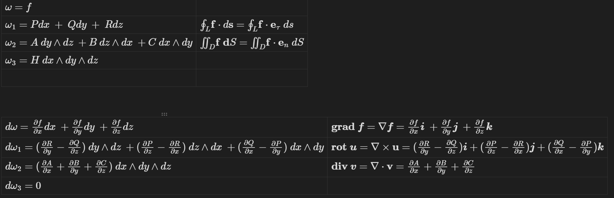

$${\int}_{\partial D} \omega = {\int}_D d\omega$$

## Exterior Differential

在三维空间上，给出所有的外微分形式：

$${\omega} = f $$
$$ {\omega}_1 = Pdx \space + \space Qdy \space + \space Rdz$$
$${\omega}_2 = A\space dy \wedge dz \space + B\space dz \wedge dx \space + C \space dx \wedge dy$$
$${\omega}_3 = H \space dx \wedge dy \wedge dz$$

对外微分求微分：
$$d{\omega} = \frac{\partial f}{\partial x}dx \space + \frac{\partial f}{\partial y}dy \space +\frac{\partial f}{\partial z}dz$$
$$d{\omega}_1 = 
\left | \begin{array}
ddy \wedge dz & dz \wedge dx & dx \wedge dy \\
\frac{\partial}{\partial x} & \frac{\partial}{\partial y} & \frac{\partial}{\partial z}  \\
P & Q & R \\
\end{array}\right| = (\frac{\partial R}{\partial y}-\frac{\partial Q}{\partial z})\space dy \wedge dz+(\frac{\partial P}{\partial z}-\frac{\partial R}{\partial x})\space dz \wedge dx+(\frac{\partial Q}{\partial x}-\frac{\partial P}{\partial y})\space dx \wedge dy$$
$$d{\omega}_2= (\frac{\partial A}{\partial x}+\frac{\partial B}{\partial y}+\frac{\partial C}{\partial z})\space dx\wedge dy \wedge dz$$
$$d{\omega}_3=0$$
我们会发现，对于n-形式求微分得到n+1-形式

## grad、div、rot

对于$\boldsymbol f = f(x,y,z)$
$$\textbf{grad} \space \boldsymbol f = \nabla \boldsymbol f = \frac{\partial f}{\partial x}\boldsymbol i \space + \frac{\partial f}{\partial y}\boldsymbol j \space +\frac{\partial f}{\partial z}\boldsymbol k$$
对于$\boldsymbol u = (P,Q,R)$

$$\textbf{rot} \space \boldsymbol u = \nabla \times \textbf u = (\frac{\partial R}{\partial y}-\frac{\partial Q}{\partial z})\boldsymbol i+(\frac{\partial P}{\partial z}-\frac{\partial R}{\partial x})\boldsymbol j+(\frac{\partial Q}{\partial x}-\frac{\partial P}{\partial y})\boldsymbol k$$
对于$\boldsymbol v = (A,B,C)$$$ \textbf{div} \space \boldsymbol v = \nabla \cdot \textbf v = \frac{\partial A}{\partial x}+\frac{\partial B}{\partial y}+\frac{\partial C}{\partial z}$$
请注意梯度和散度用$\nabla$算子时一个是直接运算，另一个是点乘，内积符号不可忽视！这导致了散度是唯一标量！

三维空间中只能有三种度，分别是梯度、旋度、散度

## 有向线元、有向面元

 知道 $$d\textbf s = (dx,dy,dz) = (\frac{dx}{ds},\frac{dy}{ds},\frac{dz}{ds})ds = \textbf e_{\tau} \space ds$$表示有向线元

 同时 $$d\textbf S = (dy \wedge dz,dz \wedge dx,dx \wedge dy) = (dScos\alpha,dScos\beta,dScos\gamma) = \textbf e_n dS$$表示有向面元

为什么有向线元是线元与切向量之积，而有向面元是面元与法向量之积？

这种形式完全是由三维空间中的外微分形式决定，表现在物理中就是环量与通量，在自由度理解就是将向量投影到唯一确定线元和面元的东西上，这个只能是单自由度的向量（投影到平面的方法与结果不唯一），切向量确定线元，法向量确定面元。

## Green Formula

$$  {\oint}_L Pdx + Qdy = {\iint}_D (\frac{\partial Q}{\partial x}-\frac{\partial P}{\partial y})\space dx dy$$
根据第二型线、面积分定义强调一下计算：
$$ {\oint}_L\textbf f \cdot d\textbf s = {\oint}_L \textbf f \cdot \textbf e_{\tau}\space ds $$$${\iint}_D \nabla \times \textbf f \space \textbf dS = {\iint}_D \nabla \times \textbf f \cdot \textbf e_n \space dS$$
 得到常见写法：
 $${\oint}_L\textbf f \cdot d\textbf s = {\iint}_D \nabla \times \textbf f \space \textbf dS$$

实际上可以理解为Stokes公式在xy的投影，dz=0

## Gauss Formula and Stokes Formula

Gauss Formula：
$$\newcommand{\oiint}{{\subset\!\supset} \mathllap{\iint}}
{\oiint}_{\Sigma外} A\space dy \wedge dz \space + B\space dz \wedge dx \space + C \space dx \wedge dy = {\iiint}_V (\frac{\partial A}{\partial x}+\frac{\partial B}{\partial y}+\frac{\partial C}{\partial z})\space dxdydz$$
$$\newcommand{\oiint}{{\subset\!\supset} \mathllap{\iint}}
{\oiint}_{\Sigma外} \textbf v \cdot d \textbf S = {\iiint}_V \nabla \cdot \textbf v \space dV = {\iiint}_V \textbf{div} \space \textbf v \space dV$$ 
Stokes Formula：
$$ {\oint}_LPdx + Qdy+Rdz ={\iint}_{\Sigma}(\frac{\partial R}{\partial y}-\frac{\partial Q}{\partial z})\space dy \wedge dz\space+(\frac{\partial P}{\partial z}-\frac{\partial R}{\partial x})\space dz \wedge dx\space +(\frac{\partial Q}{\partial x}-\frac{\partial P}{\partial y})\space dx \wedge dy $$

$${\oint}_L \textbf u \cdot d \textbf s = {\iint}_{\Sigma} \nabla \times \textbf u \space\cdot d \textbf S = {\iint}_{\Sigma} \textbf{rot} \space \textbf u \space \cdot d \textbf S$$
现在我们回顾一下外微分形式就会发现：

最左列的外微分形式和等式左边相似，外微分的微分和等式右边相似
我们来看看Green Formula：
记 $\omega _1 = Pdx+Qdy$，则$d\omega _1 = (\frac{\partial Q}{\partial x}-\frac{\partial P}{\partial y})\space dxdy$
写作：
$$ {\oint}_L \omega _1 =  {\iint}_D d\omega _1$$
同理Gauss Formula：
$$\newcommand{\oiint}{{\subset\!\supset} \mathllap{\iint}}
{\oiint}_{\Sigma外} \omega _2 = {\iiint}_V d\omega _2$$
最后的Stokes Formula：
$${\oint}_L \omega _1 = {\iint}_{\Sigma} d\omega _1$$
而回顾Newton-Leibniz Formula：
$${\int}_a ^b \frac{d}{dx}f(x)dx = f(x) | _a ^b = f(b)-f(a)$$

以上公式都是在说：区域上的信息可以通过边界上高一阶的信息表出

就像Gauss Formula，空间区域各点的散度之和可以通过区域边界的通量之和得到；对于牛莱公式，平面曲线无数个点的函数值之和可以通过曲线边界仅仅两个点的函数值之差获得，这样我们避开了复杂的内部形状，直接通过最易刻画的边界获取内部信息；同时我们也可以不考虑边界的形状，通过电荷散度获得边界的电通量

从外微分的视角来看，区域 D 上某形式的外导数的积分，等于该形式在区域 D 边界上的积分，也就是广义Stokes Formula，也是高维空间的微积分基本定理：
$${\int}_{\partial D} \omega = {\int}_D d\omega$$

| 外微分形式的次数 | 空间     | 公式                     |
| -------- | ------ | ---------------------- |
| $0$      | 直线段    | Newton-Leibniz Formula |
| $1$      | 平面区域   | Green Formula          |
| $1$      | 空间曲面   | Stokes Formula         |
| $2$      | 空间中的区域 | Gauss Formula          |

下面我们站在外微分的高度回过头看看课本上的一些奇形怪状的定理，在这之前先给出一个重要引理：

## Wedge Product

在这里顺便提一下楔积的两条性质：
>[!note]
>$dx \wedge dx = 0$
>$dx \wedge dy$ = -$dy \wedge dx$

似乎很像外积

|          |                                                  |                                |                                     |
| -------- | ------------------------------------------------ | ------------------------------ | ----------------------------------- |
| **特性**   | **楔积 (Wedge Product, ∧)**                        | **外积 (Outer Product) - 张量积形式** | **外积 (Outer Product) - 三维叉积形式 (×)** |
| **通用性**  | 适用于任意维度的向量空间，可作用于 k-向量和微分形式。                     | 适用于任意维度的向量，结果是矩阵。              | 主要定义在三维欧氏空间中 (也有七维的特殊情况)。           |
| **结果类型** | 两个向量的楔积是2-向量 (bivector)。k-向量和 l-向量的楔积是 (k+l)-向量。 | 两个向量的外积是一个矩阵。                  | 两个向量的叉积是一个向量 (伪向量)。                 |
| **代数结构** | 属于外代数。满足结合律和反对称性 (u∧v=−v∧u)。                     | 属于张量代数。一般不满足反对称性。              | 不满足结合律，但满足反对称性 (u×v=−v×u)。          |
| **几何意义** | 表示有向的“超体积”元素 (例如，长度、面积、体积等)。                     | 将两个向量的元素相乘构成矩阵。                | 结果向量垂直于原向量，长度为平行四边形面积。              |
| **符号**   | ∧                                                | 通常用并列或 ⊗ (更一般的张量积) 表示。         | ×                                   |

这在引理证明中发挥重要作用，很多项可以直接变成0和相消

## Poincaré Lemma

>[!danger] Poincaré Lemma
>若$\omega$为一外微分形式，其微分形式的系数具有二阶连续偏微商，则$dd\omega = 0$
>
>逆定理：若$\omega$是一个$p$次外微分式且$d\omega = 0$，则存在一个$p-1$次外微分形式$a$，使$\omega = da$

在三维空间中的证明就是直接微分计算，这里不具体展开
说人话就是存在一个$p-1$次的势函数

下面展开一些个人理解：总的来说，Poincaré Lemma 是连接“场”、“势”和外微分形式的关键

==在满足Poincaré Lemma的情况下==，==外微分式存在与之对应的场==，**外微分式**进行微分运算得到新的外微分式，这一旧一新外微分式对应的两个场之间也存在运算关系：
零次外微分式求微分得到一次外微分式，对应于梯度算子运算旧场得到新场，这就是梯度场
一次外微分式求微分得到二次外微分式（环量），对应于梯度算子叉乘旧场得到新场，这就是旋度场
二次外微分式求微分得到三次外微分式（通量），对应于梯度算子点乘旧场得到新场，这就是散度场

现在我们运用一下

## 无旋场、无源场、调和场

>[!note] 无旋场
>设$(G)$是一维单连通域，$F = (P,Q,R) \in C^{(1)}((G))$，则以下命题等价：
>（1）$F$是一个无旋场，即$\textbf{rot} \textbf F = \nabla \times \textbf F = 0$
>（2）单连域内任一简单闭曲线$C$的环量为0，即${\oint}_C \textbf F \cdot \textbf{ds} = {\oint}_CPdx + Qdy+Rdz =0$
>（3）$F$是保守场，即${\oint}_C \textbf F \cdot \textbf{ds}$与路径无关
>（4）$F$是有势场，即$Pdx + Qdy+Rdz$是某一函数的全微分，或者说$F = (P,Q,R) = (\frac{\partial f}{\partial x},\frac{\partial f}{\partial y},\frac{\partial f}{\partial z}) = \nabla \textbf f$

Proof:
	（1）-> （2）就是Stokes Formula
	（2）->（3）曲线加减再运用定理即可
	（3）->（1）路径为闭合曲线即可
	现在来看（1）->（4）和（4）->（1）：梯度场等价于无旋场
	$\space$
	由Poincaré引理逆定理知，$Pdx + Qdy+Rdz$是一个一次外微分式且$d(Pdx + Qdy+Rdz) = \textbf{rotF}=0$，则存在一个零次外微分式$a$，使$Pdx + Qdy+Rdz = da$，$a$就是势函数，$F$因此是有势场
	$\space$
	由Poincaré引理知，势函数$a$作为零次外微分式，其微分系数具有二阶连续偏导，则$\textbf{rotF} =dda =  0$
	
因此我们看到，势函数其实是更高一阶的信息，我们往往可以从势函数这个更高的角度获取信息和不变量，比如我们摆脱对力的形式和大小的具体关注，将会发现一系列守恒定律；我们在使用动能定理时只关注首末状态而不关心中间具体变化，这就是从边界上获取内部信息

>[!note] 无源场
>设$(G)$是二维单连通域，$F \in C^{(1)}((G))$，则以下命题等价：
>（1）$F$是一个无源场，即$\textbf{div} \textbf F = \nabla \cdot \textbf F = 0$
>（2）$F$沿$(G)$内任一不自交闭曲面$(S)$的通量为0，即$\newcommand{\oiint}{{\subset\!\supset} \mathllap{\iint}}{\oiint}_{S} \textbf F \cdot \textbf{dS} = 0$
>（3）在$(G)$内存在一向量函数$\textbf B(M)$，使$F = \nabla \times \textbf B$，即$F$是某一向量场$B$的旋度场，$B$称为$F$的一个向量势

Proof:
	在无旋场证明里已经展示了引理使用过程，现在直观感受一下（3）在说什么：旋度场等价于无源场
	$\textbf F \cdot \textbf{dS}$是二次外微分式，==同时满足了引理==，那么会有一个一次外微分式的势函数，这个势函数存在于一个场$B$
	势函数作为一次外微分式求微分得到$\textbf F \cdot \textbf{dS}$，同时$B$叉乘梯度算子得到$F$

对比一下：
>[!note] 
>$F$是一个无旋场，即$\textbf{rot} \textbf F = \nabla \times \textbf F = 0$
>$F$是有势场，即$Pdx + Qdy+Rdz$是某一函数的全微分，或者说$F = (P,Q,R) = (\frac{\partial f}{\partial x},\frac{\partial f}{\partial y},\frac{\partial f}{\partial z}) = \nabla \textbf f$
>
>$F$是一个无源场，即$\textbf{div} \textbf F = \nabla \cdot \textbf F = 0$
>在$(G)$内存在一向量函数$\textbf B(M)$，使$F = \nabla \times \textbf B$，即$F$是某一向量场$B$的旋度场，$B$称为$F$的一个向量势

（次数是指外微分的阶数，不要和多项式的次数搞混掉了，搞混就想想高阶导数）
什么感觉？判定无旋还是无源都是要从低次走向高次，因此对应的场运算次序是叉乘、点乘
由引理寻找势函数都是从高次(p次)走向低次(p-1次)，因此会发现场运算次序是直接运算、叉乘

似乎我们可以隐约感受到广义Stokes Formula表现出的某种对偶吧！

>[!note] 调和场
>无源且无旋的向量场$A$称为调和场，即 $$\nabla \cdot \textbf A = \textbf 0 ，\nabla \times \textbf A = \textbf 0$$
>因为无旋$A$存在势函数$\textbf u$，使$$ \textbf A = \nabla \textbf u$$
>因为无源，所以$$\nabla \cdot \textbf A = \nabla ^2 \textbf u = \Delta \textbf u = 0$$
>即满足$\textbf {Laplace}$方程$$ \frac{\partial ^2 u}{\partial x^2} + \frac{\partial ^2 u}{\partial y^2} + \frac{\partial ^2 u}{\partial z^2} = 0$$
>
>若$A$无旋而有连续分布的源，源强度为$\rho(M)$，且存在势函数$\textbf u$$$\rho = \nabla \cdot \textbf A = \Delta \textbf u$$$$\Delta \textbf u = \rho$$满足$\textbf {Poisson}$方程

## 运算法则

>[!note] 梯度运算法则
>$$\nabla (C_1u+C_2v) = C_1\nabla u + C_2\nabla v$$
>$$\nabla(uv) = u\nabla v+v\nabla u$$
>$$\nabla(\frac{u}{v}) = \frac{v\nabla u - u\nabla v}{v^2}$$
>$$\nabla(f(u)) = f^{'}(u)\nabla u$$

>[!important] 散度运算法则
>$$\nabla \cdot (u\textbf A) = u \nabla \cdot \textbf A + \nabla u \cdot \textbf A$$
>$uA = (uP,uQ,uR)$ 由散度定义易证  
>$$\textbf {div} \textbf A= \nabla \cdot \textbf A = \frac{\partial P}{\partial x} + \frac{\partial Q}{\partial y} + \frac{\partial R}{\partial z}$$

>[!example] 旋度运算法则
>$u$为数量值函数，否则无意义
>$$ \nabla \times (u\textbf A) = u(\nabla \times \textbf A) + (\nabla u)\times \textbf A$$
>由旋度定义易证
>$$ \textbf rot \textbf A =\nabla \times \textbf A = 
\left | \begin{array}
ii & j & k \\
\frac{\partial}{\partial x} & \frac{\partial}{\partial y} & \frac{\partial}{\partial z}  \\
P & Q & R \\
\end{array}\right| $$

>[!danger] 其他运算法则
>
>$$\nabla \cdot(\nabla \times A) = 0$$
>$$\nabla \times(\nabla A) = 0$$
>$$\nabla \times(\nabla \times A) = \nabla(\nabla \times A) - \nabla ^2A$$
>$$\nabla \cdot (A\times B) = B \cdot (\nabla \times A)-A\cdot (\nabla \times B)$$

第一条说的是旋度场等价于无源场
第二条说的是梯度场等价于无旋场

计算上会发现原因是：若二阶混合偏导数连续，则可以交换次序
我们知道从低次升到高次是在进行直接运算、叉乘、点乘，直到散度场对应的3-形式求微分为0，对应到新场就是$\textbf 0$

更广义的就是
>[!danger] Poincaré Lemma
>若$\omega$为一外微分形式，其微分形式的系数具有二阶连续偏微商，则$dd\omega = 0$

至于第三第四条与霍奇对偶相关